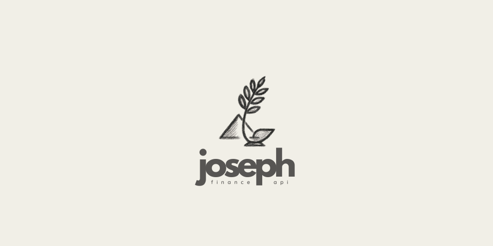

# Joseph 🧑‍💻

## Sobre o projeto

Joseph é uma aplicação para cuidar de finanças pessoais, com foco em ações (bolsa de valores). O objetivo é ajudar no controle, análise e acompanhamento de investimentos.

<div align="center">
  
</div>

### Motivação do nome 🏺

O nome "Joseph" faz referência a José do Egito, personagem bíblico conhecido por sua sabedoria em administrar recursos e planejar para o futuro. Assim como José ajudou o Egito a se preparar para tempos de abundância e escassez, esta aplicação busca auxiliar no planejamento e gestão financeira.

## Arquitetura 🏗️

O projeto adota a **Vertical Slice Architecture** (Arquitetura de Fatia Vertical).

Nesta abordagem, em vez de organizar o código por camadas técnicas (ex: `controllers`, `services`, `repositories`), nós o agrupamos por funcionalidade ou *feature*. Cada funcionalidade é uma "fatia" vertical que contém toda a lógica necessária, desde a API até o banco de dados. Por exemplo, toda a lógica relacionada ao cadastro de Ações (`Stock`) está contida no pacote `com.nazarethlabs.joseph.stock`.

Dentro de cada fatia, o código é organizado em 3 camadas principais:

- **Presentation (Apresentação):** Contém os `Controllers` que expõem a funcionalidade via API REST.
- **Application (Aplicação):** Contém os `Services` e `DTOs`, orquestrando a lógica de negócio da fatia.
- **Infrastructure (Infraestrutura):** Contém as `Entities` e `Repositories` que lidam com a persistência de dados.

Essa estrutura promove alta coesão e baixo acoplamento entre as funcionalidades, facilitando a manutenção e a evolução do sistema.

## Requisitos

- Java 21 ☕
- Gradle 🛠️
- Podman e Podman Compose 🐳

IDE recomendata: [Intelij IDEA](https://www.jetbrains.com/idea/download/?section=linux)

## Database Migrations com Flyway 🦅

O projeto utiliza o Flyway para gerenciar a evolução do esquema do banco de dados. O Spring Boot está configurado para executar automaticamente as migrações pendentes sempre que a aplicação é iniciada.

### Como criar uma nova migração

Para adicionar uma nova alteração ao banco de dados, siga estes passos:

1.  Crie um novo arquivo SQL no diretório: `src/main/resources/db/migration`.
2.  O nome do arquivo **deve** seguir o padrão de nomenclatura do Flyway: `V<VERSAO>__<DESCRICAO_CURTA_EM_SNAKE_CASE>.sql`.

    -   `V<VERSAO>`: Começa com `V`, seguido pelo número da versão (ex: `V1`, `V2`, `V1.1`).
    -   `__`: Dois underscores separam a versão da descrição.
    -   `<DESCRICAO_CURTA_EM_SNAKE_CASE>.sql`: Uma breve descrição do que a migração faz, usando letras minúsculas e underscores no lugar de espaços.

**Exemplo prático (baseado na migração existente):**

-   **Nome do arquivo:** `V1__create_stock_table.sql`
-   **Conteúdo:**

    ```sql
    CREATE TABLE stocks (
        id UUID PRIMARY KEY,
        ticker VARCHAR(255) NOT NULL,
        company_name VARCHAR(255) NOT NULL,
        CONSTRAINT uk_ticker UNIQUE (ticker)
    );
    ```

Ao iniciar a aplicação, o Flyway detectará este novo arquivo, executará o script no banco de dados e registrará a migração na sua tabela de controle de esquema.

## Como Executar

### 1. Iniciar o Banco de Dados 🗄️

O projeto utiliza Podman Compose para gerenciar o container do banco de dados PostgreSQL, conforme definido no arquivo `podman-compose.yml`.

Para iniciar o banco de dados em background, execute na raiz do projeto:

```sh
podman-compose up -d
```

Para parar e remover o container, execute:

```sh
podman-compose down
```

### 2. Executar a Aplicação ▶️

Com o banco de dados em execução, você pode rodar a aplicação Spring Boot:

```sh
./gradlew bootRun
```

Para rodar em modo debug e conectar um depurador na porta `5005`:

```sh
./gradlew bootRun --debug-jvm
```

### 📜 Documentação da API (Swagger)

O projeto utiliza o Springdoc para gerar automaticamente a documentação da API no formato OpenAPI 3. Essa documentação é interativa e permite visualizar e testar todos os endpoints disponíveis diretamente pelo navegador.

Com a aplicação em execução, você pode acessar a documentação através dos seguintes links:

- [Swagger UI (Interface Gráfica)](http://localhost:8080/docs)
- [Definição OpenAPI (JSON)](http://localhost:8080/api-docs)

## Variáveis de Ambiente e Configurações Sensíveis 🔐

Este projeto utiliza variáveis de ambiente para armazenar informações sensíveis, como tokens de API e chaves secretas. **Nunca coloque valores sensíveis diretamente no arquivo `application.yml` versionado!**

### Como configurar

1. No arquivo `application.yml`, as configurações sensíveis são referenciadas assim:

```yaml
integration:
  brapi:
    base-url: https://brapi.dev/api
    token: ${BRAPI_TOKEN}
  resend:
    base-url: https://api.resend.com
    api-key: ${RESEND_API_KEY}
```

2. Antes de rodar a aplicação, defina as variáveis de ambiente no seu terminal ou na sua IDE. Por exemplo, no terminal Linux ou macOS, você pode fazer isso assim:

```sh
export BRAPI_TOKEN=seu_token_aqui
export RESEND_API_KEY=sua_api_key_aqui
```

3. Nunca faça commit de arquivos com dados sensíveis! Use sempre variáveis de ambiente ou arquivos ignorados pelo Git.

## Testes Unitários 🧪

O projeto utiliza o JUnit 5 e o Mockito para testes unitários em Kotlin. Os testes estão localizados no diretório `src/test/kotlin`.

Para executar todos os testes unitários, utilize:

```sh
./gradlew test
```

Os relatórios de teste são gerados em `build/reports/tests/test/index.html`.

## Qualidade de Código com Ktlint 🎨

O projeto utiliza o Ktlint para garantir um estilo de código consistente.
- `./gradlew ktlintCheck` — Verifica se o código está em conformidade com as regras.
- `./gradlew ktlintFormat` — Formata o código automaticamente para corrigir violações.

## Versionamento e Release 🏷️

O projeto utiliza **Git, Conventional Commits e o plugin Axion-Release** para automatizar o versionamento e a geração de changelogs. A versão é inferida a partir das tags do Git.

### Pré-requisitos

Para gerar o changelog, você precisa ter o `conventional-changelog-cli` instalado globalmente. Execute uma única vez:
```sh
npm install -g conventional-changelog-cli --registry=https://registry.npmjs.org/
```

### Como fazer um release

Para automatizar o processo de release, utilize o Makefile incluso no projeto. Ele garante que o código está formatado, gera o changelog e cria a tag de versão automaticamente.

Execute:

```sh
make release
```

Esse comando executa, em ordem:
- `./gradlew ktlintCheck` — Garante que o código está em conformidade com as regras de estilo.
- `./gradlew generateChangelog` — Atualiza o `CHANGELOG.md` com base nos commits.
- `./gradlew reckonTagPush` — Cria e envia a tag de versão baseada nos Conventional Commits.

Se preferir, você ainda pode executar cada etapa manualmente conforme descrito abaixo:

1.  **Desenvolva e faça commits** seguindo o padrão Conventional Commits.
    - `feat:` para novas funcionalidades (resultará em um release `minor`).
    - `fix:` para correções de bugs (resultará em um release `patch`).
    - Adicione `BREAKING CHANGE:` no rodapé do commit para um release `major`.

2.  **Gere o Changelog:** Rode o comando para atualizar o arquivo `CHANGELOG.md` com as últimas mudanças.
    ```sh
    ./gradlew generateChangelog
    ```
3.  **Faça o commit do Changelog:** Adicione o `CHANGELOG.md` atualizado em um commit.
    ```sh
    git add CHANGELOG.md
    git commit -m "docs: update changelog for release"
    ```
4.  **Crie e envie a tag de versão:** Use a tarefa `reckonTagPush` para criar a tag Git e enviá-la para o repositório remoto. O plugin calculará a próxima versão (patch, minor ou major) automaticamente com base nos seus commits.
    ```sh
    # Para um release de patch (ex: 0.1.0 -> 0.1.1)
    ./gradlew reckonTagPush

    # Para forçar um release minor (ex: 0.1.1 -> 0.2.0)
    ./gradlew reckonTagPush -Preckon.scope=minor
    ```
-----

## 🤝 Como Contribuir

Nosso fluxo de contribuição é baseado em Pull Requests diretamente neste repositório:

1.  **Crie uma Branch** para sua nova feature ou correção. Use um nome descritivo (em inglês) e siga um padrão, como `feature/minha-nova-feature` ou `fix/corrige-bug-x`:
  ```bash
  git checkout -b feature/minha-nova-feature
  ```
2.  **Desenvolva e Faça o Commit** de suas mudanças. Escreva mensagens de commit claras e significativas seguindo o padrão [Conventional Commits](https://www.conventionalcommits.org/en/v1.0.0/).
  ```bash
  git commit -m "feat: Adiciona nova funcionalidade de busca por tags"
  ```
3.  **Faça o Push** para a sua branch:
  ```bash
  git push origin feature/minha-nova-feature
  ```
4.  **Abra um Pull Request** neste repositório. O título do PR deve ser claro e a descrição deve explicar o que foi feito, por que foi feito e como pode ser testado. Se o PR resolve uma Issue existente, mencione-a na descrição (ex: `Resolves #42`).

    > **Importante:** O Pull Request só será aceito se passar por todos os checks automáticos definidos no workflow `pr-checks.yml`.
    >
    > **Atenção:** A porcentagem mínima de cobertura de testes exigida pelo CI é **95%**.

-----

## 📜 Licença

Este projeto está sob a licença MIT. Veja o arquivo `LICENSE.md` para mais detalhes.
